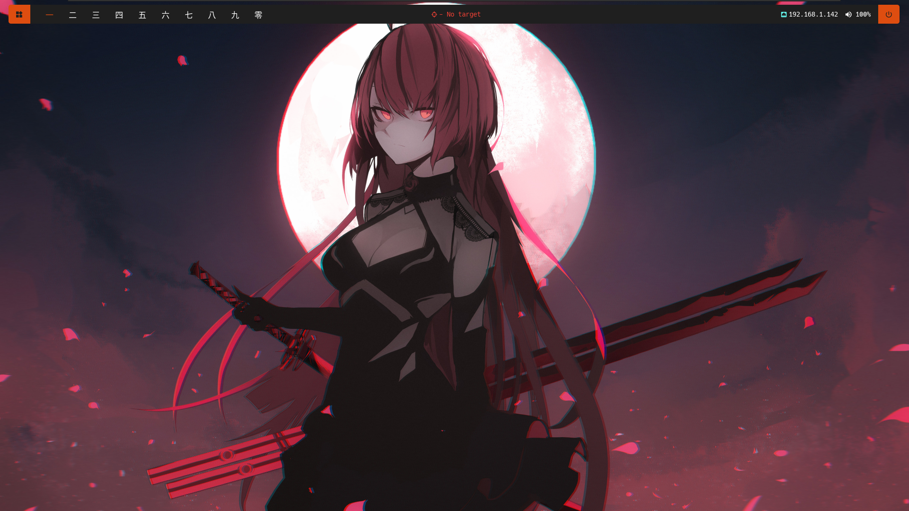
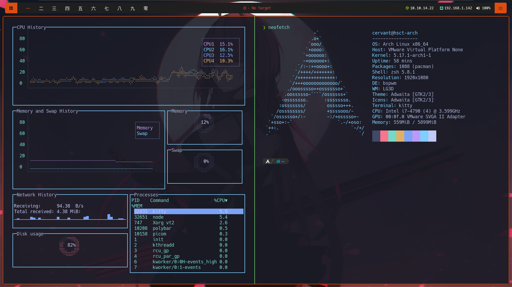
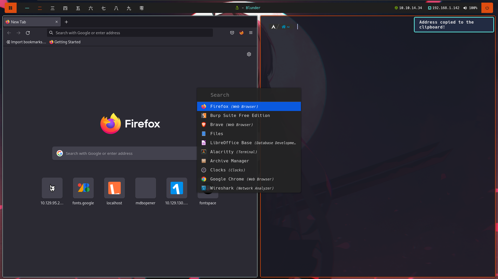

# Introduction

Inspired by [s4vitar's setup](https://youtu.be/fshLf6u8B-w) i decided to create my own custom rice using Arch Linux and my favourite software and tools. The purpose of this repo is to organize my settings, scripts and keyboard shortcuts and make it available for anyone who wants to use it. I'm not going through the installation process.

---

# Screenshots








---

# Components

* [bspwm](https://github.com/baskerville/bspwm) as window manager.
* [sxhkd](https://github.com/baskerville/sxhkd) to manage shortcuts.
* [kitty](https://github.com/kovidgoyal/kitty) terminal using zsh shell and [Powerlevel10k](https://github.com/romkatv/powerlevel10k).
* [polybar](https://github.com/polybar/polybar) used as status bar and for custom scripts.
* [dunst](https://github.com/dunst-project/dunst) for notifications.
* [picom](https://github.com/yshui/picom) compositor for transparency and round corners.
* [rofi](https://github.com/davatorium/rofi) as program launcher.


---

# Keybinds

## sxhkd

| Keybind                          | Action                            |
|----------------------------------|-----------------------------------|
| ```super + enter```              | spawn terminal                    |
| ```super + d```                  | open rofi                         |
| ```super + q```                  | quit bspwm                        |
| ```super + r```                  | restart bspwm                     |
| ```super + [1-0]```              | select workspace                  |
| ```super + alt + [1-0]```        | move current panel to workspace   |
| ```super + [arrow keys]```       | focus panel                       |
| ```super + alt + [arrow keys]``` | resize panel                      |


For more keybinds check ```.config/sxhkd/sxhkdrc```.

## kitty

| Keybind                      | Action                       |
|------------------------------|------------------------------|
| ```ctrl + shift + enter```   | spawn new window             |
| ```ctrl + shift + r```       | resize window                |
| ```ctrl + shift + w```       | close window                 |
| ```ctrl + shift + t```       | spawn new tab                |
| ```ctrl + shift + alt + t``` | rename current tab           |
| ```ctrl + shift + z```       | zoom current window (toggle) |
| ```ctrl + shift + l```       | arrange windows layout       |


For more information refer to [kitty Documentation](https://sw.kovidgoyal.net/kitty/overview/).

---

# Custom scripts

* bspwm
    + [bspwm resize](/.config/bspwm/scripts/resize): script used to resize bspwm panes, credits to [s4vitar](https://s4vitar.github.io/bspwm-configuration-files/).
* polybar
    + [eth status](/.config/polybar/material/scripts/eth_status.sh): display Ethernet (eth0) IP address in the polybar.
    + [vpn status](/.config/polybar/material/scripts/vpn_status.sh): display VPN (tun0) IP address in the polybar.
    + [vpn copy address](/.config/polybar/material/scripts/vpn-copy-address.sh): copy VPN IP address to the clipboard, mostly used in CTF. Assigned as left-click action.
    + [target](/.config/polybar/material/scripts/target.sh): display target address in the polybar, along with a health check. Used in HTB/THM CTF.
    + [target copy address](/.config/polybar/material/scripts/target-copy-address.sh): same as before, copy target address to the clipboard. Assigned as left-click action.

---

# Fonts

* [Hack Nerd Fonts](https://www.nerdfonts.com/) used in terminal, rofi, dunst and polybar.
* [Noto Sans JP](https://fonts.google.com/noto/specimen/Noto+Sans+JP) used in polybar workspaces.

---
<div align="center">

<a href="https://github.com/Brsalcedom/dotfiles/blob/main/.github/LICENSE">

</div>